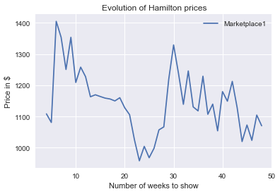
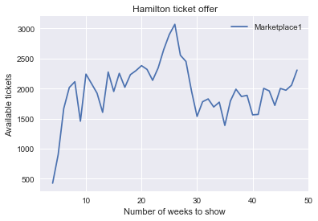
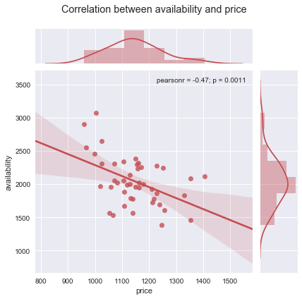
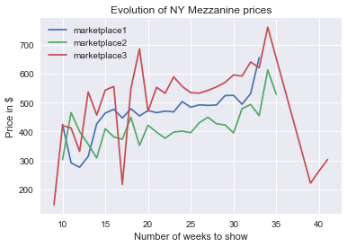
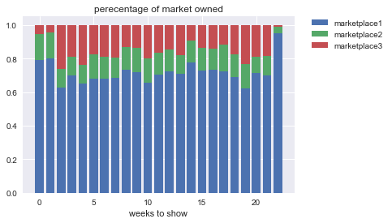
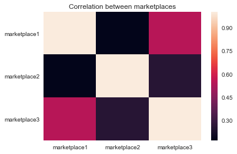

# Ticket Market Analysis

We investigate the evolution of secondary ticket markets for major theatre shows in New York.

# Dataset

We gathered data from three market places that combined contribute to 40\% of tickets sold for the plays "Hamilton", "The book of Mormon", "Angels in America" and "Farinelli and the King". Our data consists of over 150,000 tickets gathered across all categories.  

# General Patterns
We study the evolution of ticket prices for the show "Hamilton" as the date of the show approaches.

## Price Drop

One striking feature we observe consistently is a huge drop in price between weeks 20 through 30 leading to the show.

This feature is similar to what happens for Super Bowl pricing patterns. We refer the reader to this interesting podcast on the phenomenon https://www.npr.org/sections/money/2018/02/02/582861315/episode-822-the-shortest-super-bowl.

## Supply

We now plot the number of tickets available for the show per week and notice that the graph seems to correlate negatively with that of ticket pricing above.

The correlation coefficient between price and ticket availability is -0.36. However, the correlation between ticket prices and ticket availability is at its strongest when looking at ticket availability 2 weeks prior. 

With a p-value close to 0.1\%, we confidently may reject the null-hypothesis that the price and availability are uncorrelated.

# Relationship between the three different market places 

We now have a look at how prices from one market place affect that of another. We start by plotting the price evolution.

We notice that while marketplace1 and marketplace2 seem more stable, marketplace3 is highly volatile. One of the reasons for this comes from the fact that marketplace3 owns a smaller percentage of the market share, so that it is more sensitive to outliers. Indeed, the market share is divided as follows.

Finally, we notice that the prices from one market place may influence the variation in price from another market place. The following is a heatmap showing the correlation between prices from each market place.

We notice that marketplace1 and marketplace3 are particularly correlated with prices oscillating similarly.

# Further Investigations

This project is stil work in progress. In particular we would like to investigate better the nature of the price drops: predict them and their shape.

